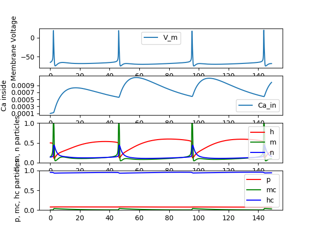

### About

A NestML model that implements a 5HT modulated motor neuron. The base for this model was an existing [Neuron simulator model](https://senselab.med.yale.edu/ModelDB/showmodel.cshtml?model=189786) by Moraud EM, Capogrosso M. The modulation by 5HT is made by a variation in the conductivity of K-Ca channels according to [Booth et al., 1997](http://refhub.elsevier.com/S0896-6273(16)00010-6/sref4).

### Usage

The model can be used as a custom Nest model.
```python
nest.Install("research_team_models")
neuron = nest.Create(
    'hh_moto_5ht', params={
        "g_K_Ca_5ht": 0.6,
        "C_m": 200.0,
        "t_ref": 0.0,
    }
)
```
The parameter that represents 5HT modulation is `g_K_Ca_5ht`. When it equals `1.0`, no modulation happens. An application of 5HT corresponds to its decrease. The default value is `0.6`. This value was used in the Neuron simulator model. The range of this parameter is `(0, 1]` but you are free to play with any value.

### Build
The model is written in NestML. **IMPORTANT!** For the time of writing this README, [NestML](https://github.com/nest/nestml/tree/31f4b97dab299150bb44f4dcfdc7fac499a81b38) worked for me only with Python2.7. Keep it in mind when building this model.

Please use `build.sh` to prepare the model for NEST. It requires that you have a proper installation of NestML and there is an environment var `NESTML_INSTALL_DIR` that leads to it. In case of a successful building the `build` dir should contain a NEST model and this model should be accessible in NEST under the namespace `research_team_models`. Please see Usage above.
  
The below instructions are given in case you want to customize the build process. The location for these instructions is the **project's root** location.

To build the model for NEST:
```
java -jar <path to nestml 'target' dir>nestml.jar research_team_models --target build
```

To install the built to NEST:
```
cd build
cmake -Dwith-nest=$NEST_INSTALL_DIR/bin/nest-config .
make all
make install
```

More details in the [NestML repo](https://github.com/nest/nestml/#installing-and-running-nestml)

### Verification

We use an existing Neuron implementation of the same model for verification. For now it has been tested that the model behaves the same under a DC current in 700pA.

<table>
    <tr>
        <td>Neuron simulation result</td>
        <td>NEST simulation result</td>
    </tr>
    <tr>
        <td></td>
        <td></td>
    </tr>
</table>

